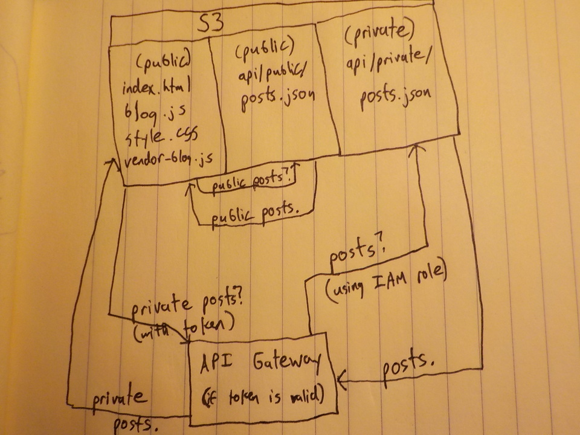
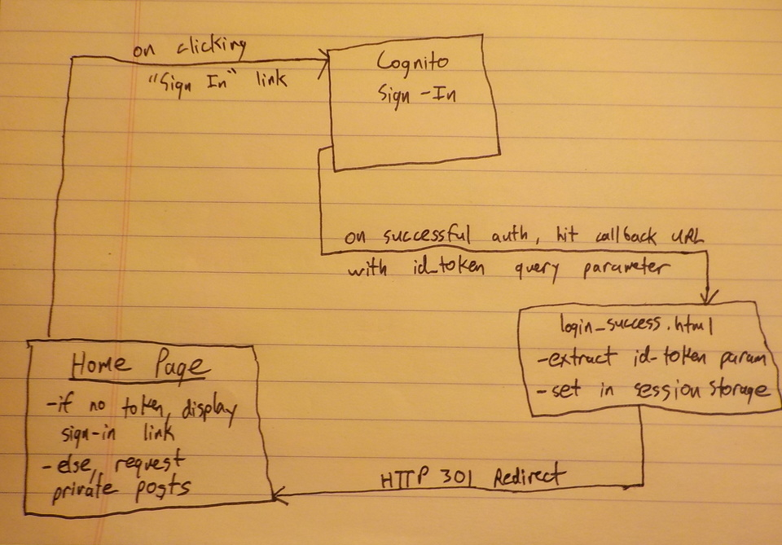

# ft-frontend

The code behind my family-photo sharing blog, https://fischerthings.com.

## Motivation

Things are happening to my family, the Fischers, and I wanted to share them with relatives who live physically far away. I chose to make this site, instead of using traditional social media, for two primary reasons:
* It affords me a little more control of my family's data.
* It was a fun challenge, and I was able to learn quite a bit about the very latest in serverless web development, which is pretty cool!

So, given that background, here are the axioms I built this project from:
* It'll be a one-way data flow, from my immediate family (the authors) to the audience.
* I will have both publically and privately available posts, depending on the nature of the topic.
* Private posts, by some mechanism to be determined later, should only be available to persons I authorize - my extended family, friends, and other people I know personally (at most ~1000 users).
* **[K.I.S.S.](https://en.wikipedia.org/wiki/KISS_principle)**: HTML is a perfectly valid standard. CSS doesn't have to be complicated (shoutout to [bettermotherf\*\*\*ingwebsite](http://bettermotherfuckingwebsite.com/) for my jumping-off point). Keep things simple! This principle also leads to having a good experience on mobile, FWIW.
* The latest and greatest in web development is serverless, and I want to do that. Given my low expected usage, a lot of the points raised in [this article](https://read.acloud.guru/six-months-of-serverless-lessons-learned-f6da86a73526) resonated with me. Why should I bother adminstering a server?

## Technologies I Use

So, what did I end up building? In short, it's a [Vue](https://vuejs.org/) application, served as static HTML/Javascript/CSS files that are hosted in [S3](https://docs.aws.amazon.com/AmazonS3/latest/dev/WebsiteHosting.html). Data for individual posts is stored as JSON in S3 and accessed via XMLHttpRequests. Access to data I deem "private" is only available through token restricted [API Gateway](https://aws.amazon.com/api-gateway/) calls, whereas public data is exposed to the world. Authentication is handled by [Cognito](https://aws.amazon.com/cognito/), which grants the tokens that allow API access. I also make use of a [Lambda](https://aws.amazon.com/lambda/) function, to create just-in-time signed URLs with which to access otherwise private images for a limited period of time.

In this document I'll be largely focusing on the frontend (Vue) code, see [ft-backend](doc/ft-backend/README.md) for READMEs detailing the setup of my AWS resources (Cognito, API Gateway, and Lambda). It is worth noting that, outside of DNS registration, everthing I'm doing fits into the AWS free tier.

## App Details

There's not much complexity to my site. There's a home page, which lists all the available posts, and the post pages themselves. You can see these in action at the root https://fischerthings.com page and https://fischerthings.com/#/posts/mc, respectively. URL resolution is handled by an instance of vue-router, [seen here](https://github.com/efischer19/ft-frontend/blob/master/src/router.js).

### Home Page

The code for the Home page lives at [src/views/Home.vue](https://github.com/efischer19/ft-frontend/blob/master/src/views/Home.vue). It asks for data about available posts, [which looks like this](https://github.com/efischer19/ft-frontend/blob/master/public/api/public/posts.json), and creates a list of links to individual posts. Public data is always requested, while private data is only requested if the user is signed in (I'll cover auth in a bit, hold on!). Post listings are grouped by topic, and each post lists its published date as well. Below is a picture illustrating that flow:

### Post Page

Blog posts (code available [here](https://github.com/efischer19/ft-frontend/blob/master/src/views/Blog.vue)) are made up of 5 simple components - title, header, image, paragraph, and list. These `Blog*` components all live in [src/components](https://github.com/efischer19/ft-frontend/tree/master/src/components) and contain their own logic/styling, as needed. Much like the Home page, data for a post ([looks like this](https://github.com/efischer19/ft-frontend/blob/master/public/api/public/mc/post_data.json)) is requested via XHR. Both pages also cache the results of these data requests in sessionStorage, because it would be silly to re-send that data over the wire.

### Authentication

Authentication lives on top of all that. The [SignIn component](https://github.com/efischer19/ft-frontend/blob/master/src/components/SignIn.vue) is a header that live at the top of the Home page. It displays a link to `signin.fischerthings.com`, a [Cognito custom domain](https://docs.aws.amazon.com/cognito/latest/developerguide/cognito-user-pools-add-custom-domain.html). On successfully authenticating, the user is redirected to
[login_success.html](https://github.com/efischer19/ft-frontend/blob/master/public/login_success.html), with a valid id token contained in the URL query string. Note that this page is not technically part of my app - you aren't allowed to use fragment URLs as Cognito callbacks, so I made do. That page will load the id token into sessionStorage, where my main ft-frontend app knows to look for it, before re-routing the user to the app Home page again. Here's what that flow looks like:

I'm currently just checking for the existence of the token in my app, since the API Gateway is what actually protects private data. If you were motivated, it'd be pretty easy to reverse-engineer a sessionStorage item that would "trick" my home page into diplaying your "username".

If a token does exist, the Home page will fire off an API Gateway request containing the token and an API key (read [this comment](https://github.com/efischer19/ft-frontend/blob/37a4d909849e177a4e56a8e43f3f3aae5f7edc5e/src/views/Home.vue#L41-L50) for some background on why I don't bother obfuscating the URL or API keys). The API Gateway validates the token and, on success, returns a nonpublic but similar posts.json. The Blog page is similar, but with one addition. Since the
data contained in post_data.json includes `img` urls, I must return a publically-available URL in order to get it to display in the rendered HTML. But I don't want to expose this picture to the public! What should I do? The answer is an expires-after-20-minutes signed S3 URL, which I create in the Lambda attached to my API Gateway. This makes the picture available to the (authenticated) user who requested it, but does not run the risk of having it permanently exposed to the world.

### Meta Code

I elected to try out [Jest](https://jestjs.io/) for testing in this repo. In my opinion, unit tests are no worse than any other framework, and snapshot tests are particularly easy to setup and very useful. In addition, I've set up [Travis CI](https://travis-ci.com/efischer19/ft-frontend) integration, complete with automated deployment after tests pass on master.

## So How Can I Use This Code?

That's a good question! I haven't really done any work to facilitate that at this point, but there's no reason you couldn't use it for a site similar to mine. Feel free to copy, fork, or suggest changes to my code as you see fit, it's open source!

If you want private access to see family pictures, you ought to already know me on a personal level - please reach out via call, text, email, or DM, and I'll get you set up.

## What's Next?

Honestly, it depends on what I have time for. I think I have the perfect use case for making a [Progressive Web App](https://developers.google.com/web/progressive-web-apps/), for one thing. I'd also love to add some more features like authoring support (I currently hand-edit the json in vim, that's why [this template](https://github.com/efischer19/ft-frontend/blob/master/public/api/post_data.template.json) exists), some rudimentary form of user interaction (comments, likes, etc. Maybe.), or full integration of my kinda-janky [picture prep script](doc/img_prep/label_img.js). For now though, I'm going to
focus on having experiences to document on the site as it exists today.
