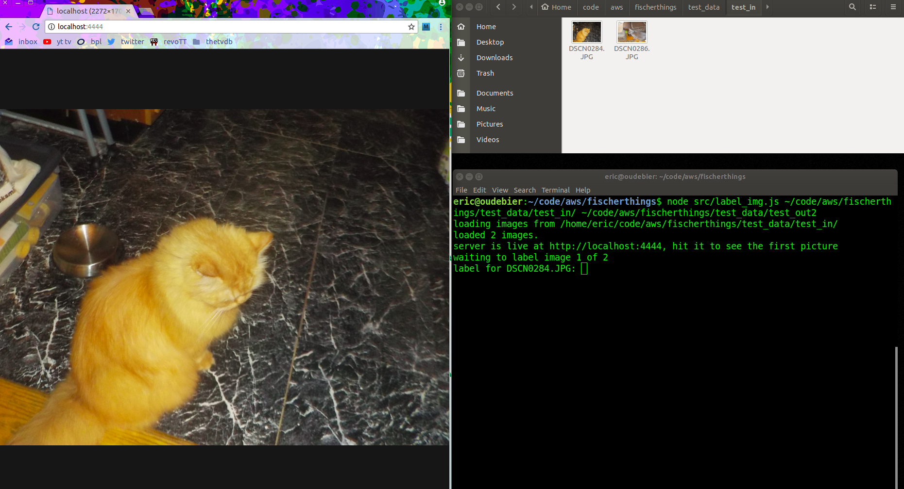
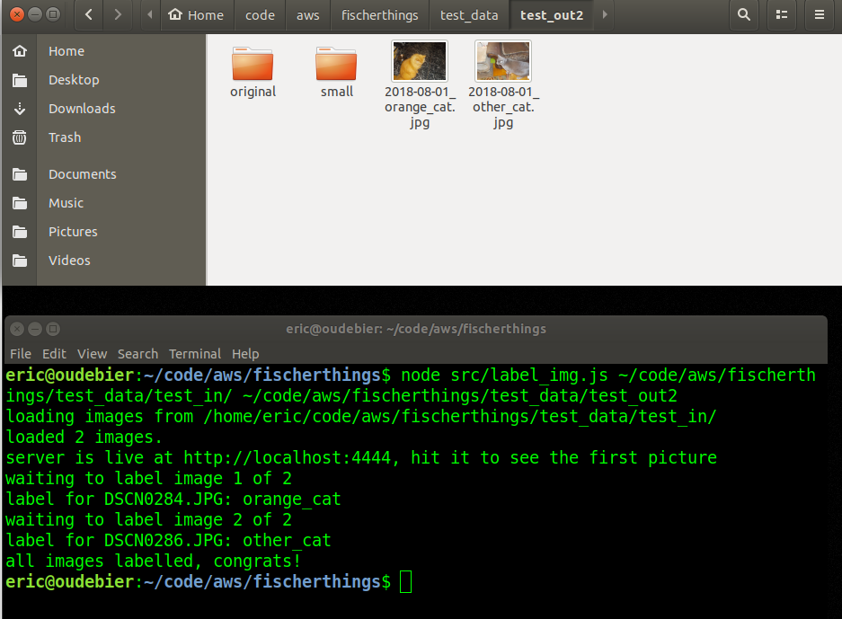

# ft-backend/img_prep

This is a threw-it-together-rapidly mash-up of node and bash that I use to label image files as they come off my camera/phone/other generic image source. The purpose is twofold - to strip EXIF data before uploading pictures to the internet, and to standardize size of the displayed assets.

[View (but plese don't judge) the code here](label_img.js)

Here are some screenshots showing the script in action - I always run a terminal in one portion of the screen, and a browser in the other. After labelling the current picture in my terminal, I refresh the browser to see the next image and repeat.

***

These are the external commands referenced in the script:
* `convert`: From ImageMagick, details on their site [here](http://www.imagemagick.org/script/convert.php)
* `exiftool`: by Phil Harvey. [Official Site](http://owl.phy.queensu.ca/~phil/exiftool/)
